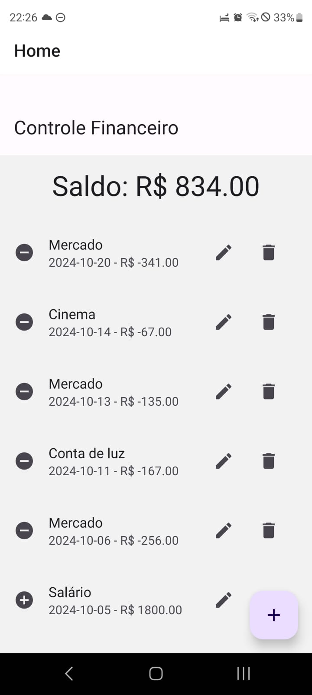

# Controle Financeiro Pessoal 📱

Aplicativo de controle financeiro pessoal desenvolvido em React Native com Expo, destinado a ajudar pessoas a gerenciarem suas finanças de forma simples e eficiente. Inicialmente pensado para autônomos, o app é adaptável para qualquer pessoa que deseje controlar seus gastos e rendimentos.

## 📋 Funcionalidades

- **Cadastro de Lançamentos**: Registre receitas (entradas) e despesas (saídas).
- **Visualização de Saldo**: Exibe o saldo atualizado em tempo real.
- **Histórico de Lançamentos**: Lista os lançamentos com opções de edição e exclusão.
- **Filtros de Categoria e Data**: Filtre lançamentos por categoria e data para fácil consulta.
- **Data com Seleção de Calendário**: Escolha de data através de um calendário.
- **Controle Offline**: Dados salvos localmente usando AsyncStorage.

## 🛠 Tecnologias Utilizadas

- **React Native** com Expo
- **AsyncStorage** para armazenamento local
- **Expo DateTimePicker** para seleção de datas
- **Material Design** para uma interface amigável e responsiva

## 🚀 Instalação e Execução

### Pré-requisitos

- Node.js (>=14)
- Expo CLI
- Conta no [Expo](https://expo.dev/)

### Passo a Passo

1. Clone o repositório:
   ```bash
   git clone https://github.com/glaucosv/controle-financeiro.git
   cd controle-financeiro
2. Instale as dependências:
   npm install

3. Inicie o servidor de desenvolvimento Expo:
   expo start

🎨 Screenshots
 

🧑‍💻 Contribuições
Sinta-se à vontade para enviar issues e pull requests para melhorar o aplicativo! Toda contribuição será bem-vinda.

📄 Licença
Este projeto está sob a licença MIT. Consulte o arquivo LICENSE para mais detalhes.

📞 Contato
Para mais informações, entre em contato em:

E-mail: glaucosv@gmail.com
